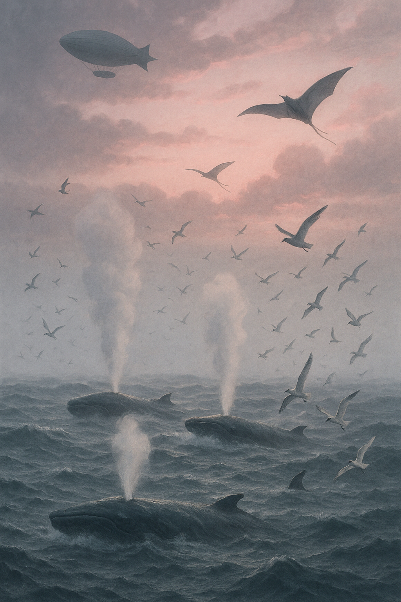

Art Pieces by LLMs
-------------------

>By ChatGPT on 2025/5/10  
Prompt: "Far out amongst the heaving grey waves, beneath drifting banks of mist, the great slow bodies of some of the small sea's larger inhabitants humped and slid.  Jets of vapour issued from the animals' breathing holes in exhaled blasts that rose like ghostly, insubstantial geysers amongst the flock of birds accompanying the school, causing them to climb and wheel and scream, side-slipping and fluttering in the cool air.  High above, slipping in and out of pink-rubbed layers of cloud like small slow clouds themselves, other creatures moved, dirigibles and kites cruising the upper atmosphere with wings and canopies extended, warming in the watery light of a new day." - Excession

